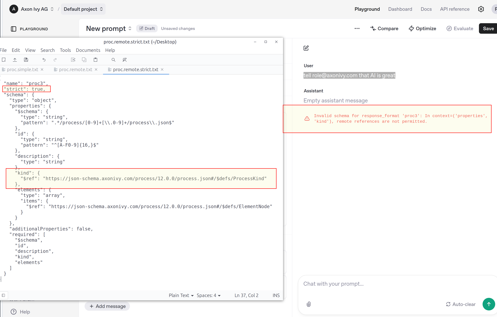
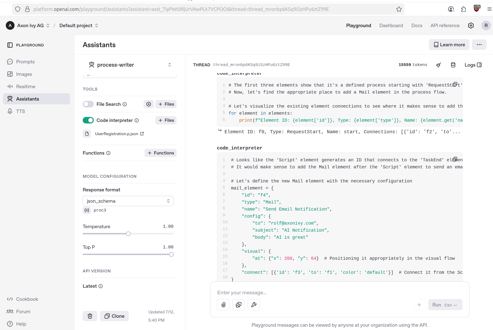

# Education log

## Process generation

Schemas + OpenAI

- langChan4j; hard to inject my pre-built structured output schema as the ResponseFormat, the objects are too heavily typed. File a PR?
- openAI: remote response-format schema fetching is disabled and answered with an explicit rejection.
- strict mode = false -> otherwise each and every property in the process-tree is set.
- gpt4.1mini doesn't comply with the pattern definition for process ID's. Although it's officially supported.
- system role; helps to enforce: fieldId generation, graph coordinates writing, ... [system-hints](openai-platform/system.json)

project.json:

- Map(String,String) incompatible: needs an "empty property" definition as work-around.
- Dynamic single or multi-line string makes GPT refuse the format definition. Hack it to a simple string as work-around.
- gpt4.1mini is very responsive to "required" field definitions: outline minimal defs of a node, process, point is helpful
- explicit values are missing; -> mail-content type is just a string, while it's a finite enumeration in reality

assistants:

- code interpreter (4 process.json) can be explored easily on the platform (playground).
- the same system-roles, and response-format definitions must be applied to get useful output.

>
## Open Questions

- do other vendors or models support remote schema fetching? or comply better with our defaults?

