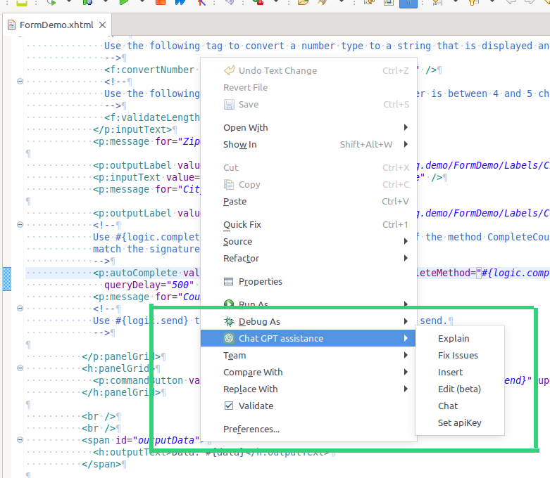

# ChatGPT Code Assistant

AI Context assistance for all your code works within the Designer IDE. 

Helps you by:

- explaining code snippets
- fixing broken codes
- inserting new statements
- answering questions about your code

## Demo

The assistant context menu, popping up in all code-editors:


Supports you in reviews, by explaining existing code:


Accepts insert or change code change requests in natural language:


Allows you to select and apply the changes you were asking for:


## Setup

1. Install this Dropin extension by pressing the 'install' button in the market.
2. After installing, reboot the Designer, as advised by the dropin-installer.
3. Setup the OpenAI API key

### OpenAI API key

ChatGPT requests do not come for free. However, when you register a new account,
 5$ are automatically added to it. This is perfect to develop your ChatGPT integration free of charge.

1. Register an account on [platform.openai.com](https://platform.openai.com/overview).
2. Once logged in, click on your user icon on the upper right corner.
3. In the menu, use the "View API keys" option.
4. Generate a new API key
5. Open a Designer where the openai-assistant was installed.
6. Right click into a code editor: select `ChatGPT assistant` > `Set apiKey` > fill in your secret key.

### Customization

The OpenAI assistant uses the designer app.yaml to load custom settings.
The following keys are valid and interpreted:

```
@variables.yaml@
```
