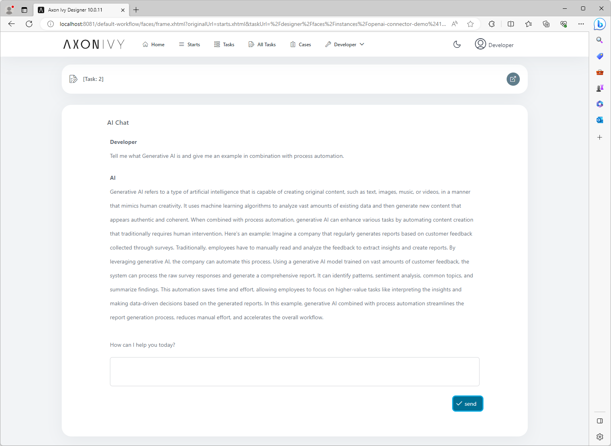
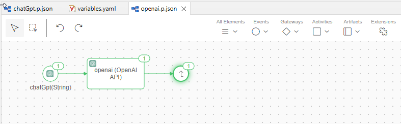
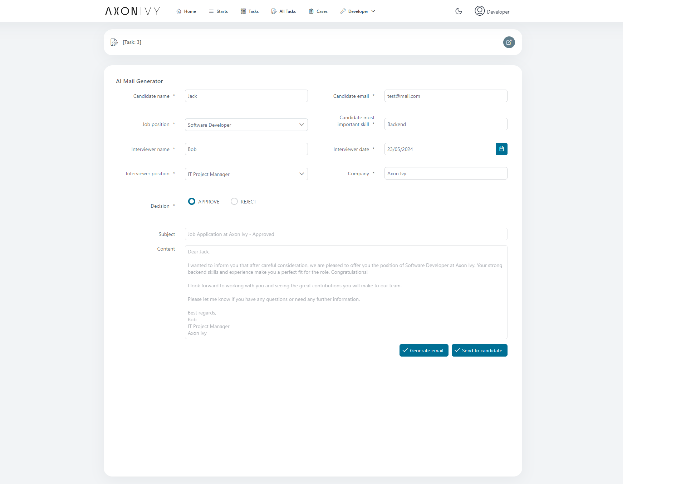

# OpenAI ChatGPT API

Axon Ivy's OpenAI ChatGPT API connector is a powerful tool that can help accelerate any process automation project by integrating the most advanced conversational chatbot into your business processes. With the ability to understand natural language and provide personalized responses, ChatGPT can revolutionize how your business interacts with customers and employees. 

This connector:

- is based on the OpenAI API https://platform.openai.com/.
- provides a simple chat frontend to communicate with all available AI services.
- supports you with an easy-to-copy demo implementation to reduce your integration effort.
- enables low-code citizen developers to automate business processes with AI-led support.

## Demo

This demo showcases a simple prompt window to chat directly with ChatGPT. Enter in any language a question that is of interest, and you will immediately get ChatGPT’s answer within the Axon Ivy business process.




This is the demo showcase for generating the email subject and content base on the information which is entered by the user.



## Setup

Chat GPT requests do not come for free. However, when you register a new account,
 5$ are automatically added to it. This is perfect to develop your Chat GPT integration free of charge.

1. Register an account on [platform.openai.com](https://platform.openai.com/overview).
2. Once logged in, click on your user icon on the upper right corner.
3. In the menu, use the "View API keys" option.
4. Generate a new API key and store it in your variables.yaml under `Variables.openai-connector.apiKey`

```
@variables.yaml@
```
