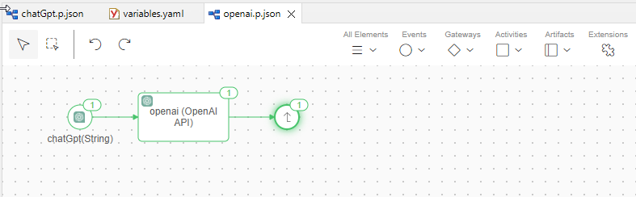
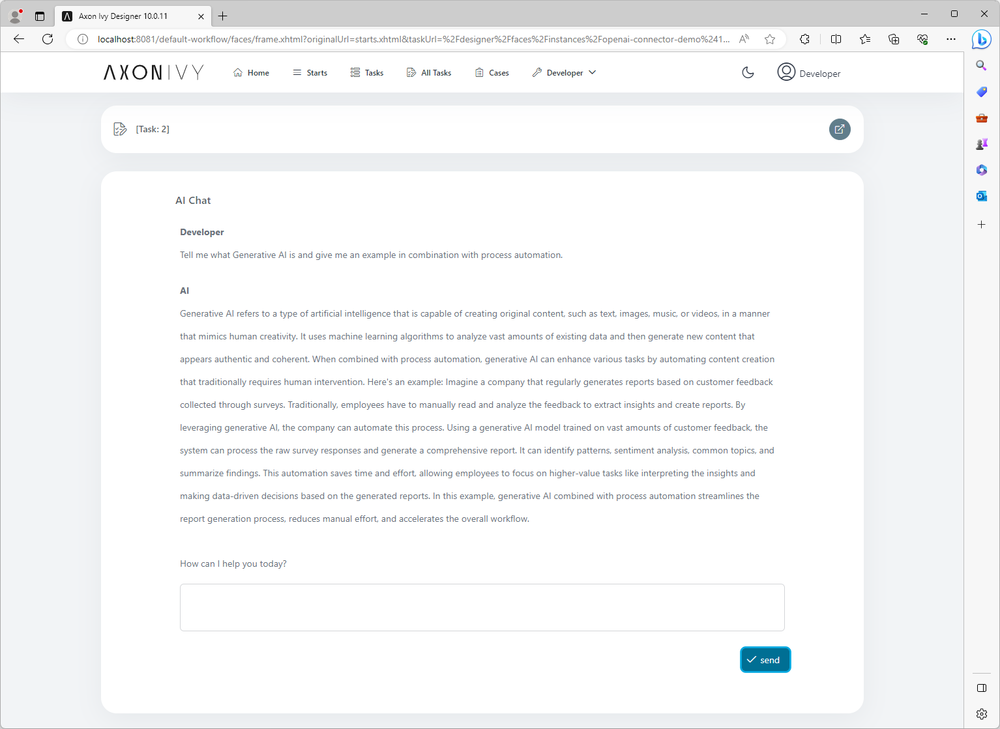
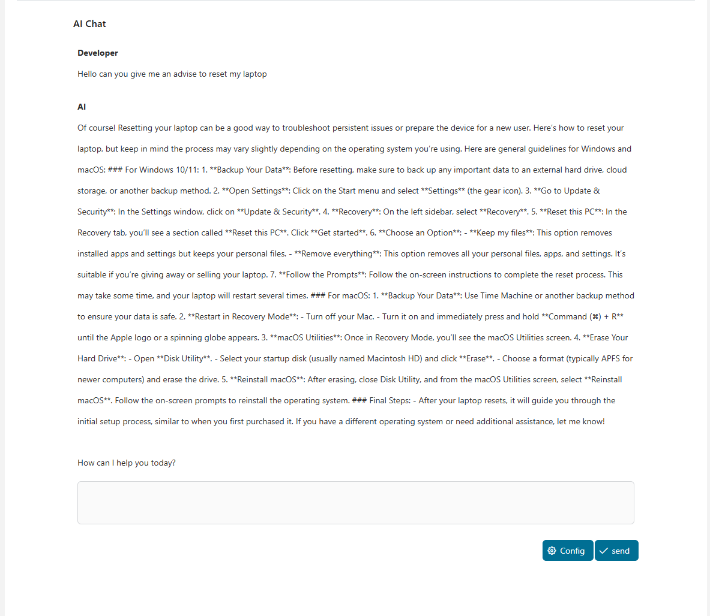
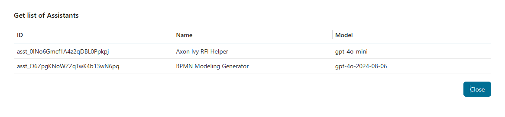
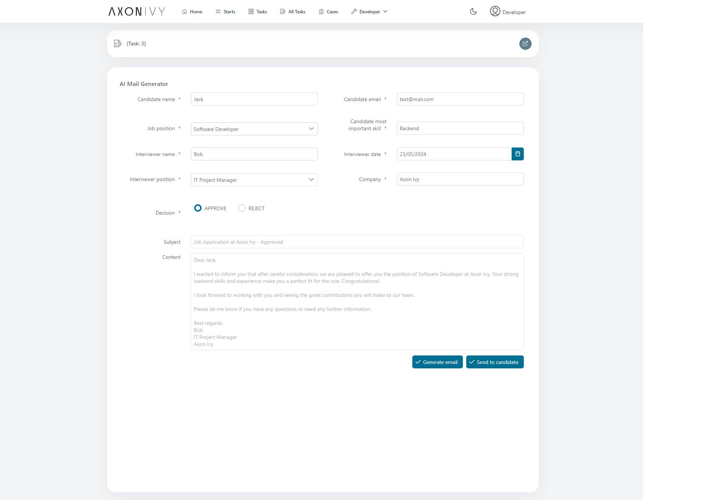

# OpenAI ChatGPT 4 AxonIvy

OpenAI ChatGPT 4 AxonIvy connects your Axon Ivy processes to OpenAI services so you can run chat completions, inspect assistants, and generate tailored emails from business data.

The connector talks to the OpenAI API at [api.openai.com/v1](https://api.openai.com/v1) and uses a dedicated REST client configuration for secure, reusable access.



**Key features**

- Ask questions and continue conversations inside Axon Ivy with OpenAI-backed chat responses.
- Generate personalized candidate emails from process data, reducing manual drafting work.
- List OpenAI assistants in a simple UI so you can review available agents quickly.
- Control the model and temperature from the dialog, giving users easy tuning without code changes.
- Reuse connector callable subprocesses from other processes to keep AI integration centralized.
- Configure secure REST access with a dedicated auth feature and OpenAPI endpoint metadata.

## Demo

Try the included demos to see the connector in action across chat, assistant lookup, and email generation.

### Demo Workflows

#### openai-connector-demo (openai-connector-demo)

##### AI Chat

1. Launch the AI Chat demo from the task or start list.
2. Open the configuration dialog to choose the model and temperature that fit your use case.



3. Enter your question, then send it to the AI.
4. Review the conversation history and continue the discussion as needed.



##### Get list of Assistants

1. Launch the assistant list demo.
2. Wait for the app to call the OpenAI Assistants API and load the results.



3. Review the assistant ID, name, and model in the table.
4. Close the view when you are done.

##### AI Mail Generator

1. Launch the AI Mail Generator demo.
2. Fill in the candidate and interview details, then choose the job position and decision.



3. Generate the email draft and review the subject and content that are created for you.
4. Send the mail to the candidate once you are satisfied with the result.

## Setup

- **Roles:** Everybody (configured in `config/roles.xml`)
- **OpenAPI:** https://raw.githubusercontent.com/axonivy-market/openai-openapi/refs/heads/master/openapi.yaml

1. Add your OpenAI API key to `config/variables.yaml` in `openaiConnector.apiKey`.
2. Keep the REST client configured with the OpenAI base URL `https://api.openai.com/v1`.
3. Leave the `OpenAIAuthFeature` in place so the connector sends the API key as `Authorization: Bearer ...`.
4. Verify that the OpenAPI spec URL points to the OpenAI schema used by the connector.

### Variables

```
@variables.yaml@
```

## Components

### Callable Subprocesses

#### openai.p.json

- **Signature**: chatGpt(String what, com.openai.api.v1.client.CreateChatCompletionRequest.ModelEnum model, BigDecimal temperature) -> answer: String
  - **Description**: The client request sets up all required and optional variables to send a request and receive content generated by the AI model.
  - **Input:**
    - `what` (String) - The message or prompt to send to the model.
    - `model` (com.openai.api.v1.client.CreateChatCompletionRequest.ModelEnum) - The model to use for the response.
    - `temperature` (BigDecimal) - The temperature that controls response creativity.
  - **Result:**
    - `answer` (String) - The generated answer returned by OpenAI.

- **Signature**: getAssistants() -> assistants: List<com.openai.api.v1.client.AssistantObject>
  - **Description**: Retrieve the current assistants from the OpenAI Assistants API and return them to the calling process.
  - **Input:** (none)
  - **Result:**
    - `assistants` (List<com.openai.api.v1.client.AssistantObject>) - The assistants returned by the OpenAI API.

### Dialog Components

#### ChatWithAi — Chat with the AI assistant from a simple dialog

- **Namespace:** com.openai.connector.demo.ChatWithAi
- **Component type:** UI dialog
- **Fields:**
  - `message` (String) — The prompt the user enters before sending a chat message.
  - `conversation` (java.util.List<com.openai.connector.demo.Message>) — The conversation history shown in the dialog.
  - `model` (com.openai.api.v1.client.CreateChatCompletionRequest.ModelEnum) — The selected model for the AI response.
  - `temperature` (java.math.BigDecimal) — The response temperature used to tune creativity.
- **Purpose:** Lets you chat with OpenAI, adjust the model configuration, and review the full conversation in one place.

#### GetAssistants — Show the assistants available in OpenAI

- **Namespace:** com.openai.connector.demo.GetAssistants
- **Component type:** UI dialog
- **Fields:**
  - `assistants` (List<com.openai.api.v1.client.AssistantObject>) — The assistants loaded from the OpenAI API.
- **Purpose:** Displays the assistant list so you can inspect IDs, names, and models before choosing one.

#### MailGenerator — Generate a personalized email for a candidate

- **Namespace:** com.openai.connector.demo.MailGenerator
- **Component type:** UI dialog
- **Fields:**
  - `mail` (com.openai.connector.demo.AIGeneratedMail) — The generated mail content that is shown and sent.
  - `message` (String) — The prompt text that gets sent to the AI model.
  - `candidateInformation` (com.openai.connector.demo.CandidateInformation) — The candidate details used to create the mail draft.
- **Purpose:** Helps you draft and send a tailored email based on candidate and interview information.

### Maven Artifacts

1. openai-connector

```xml
<dependency>
  <groupId>com.axonivy.connector.openai</groupId>
  <artifactId>openai-connector</artifactId>
  <type>iar</type>
</dependency>
```

2. openai-connector-demo

```xml
<dependency>
  <groupId>com.axonivy.connector.openai</groupId>
  <artifactId>openai-connector-demo</artifactId>
  <type>iar</type>
</dependency>
```
