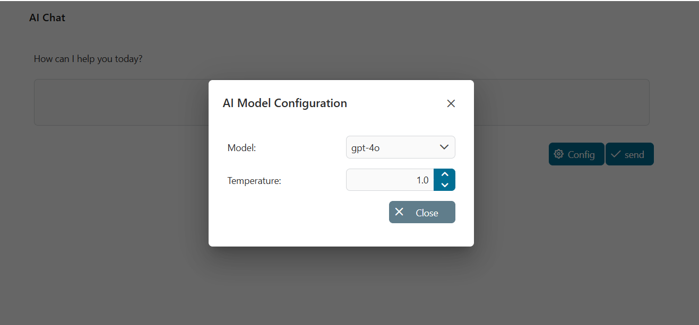
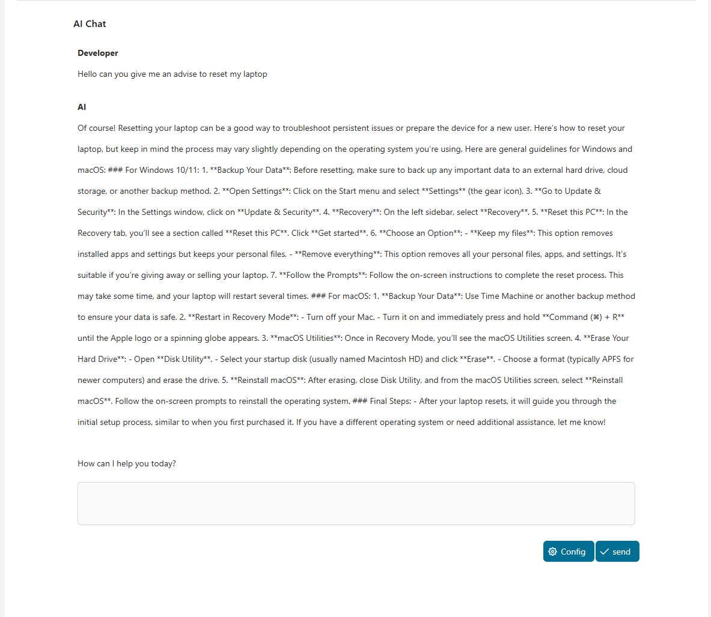

# OpenAI ChatGPT API

ChatGPT is an AI model developed by [OpenAI](https://openai.com/). It can communicate with you in natural language and support you in various language-based tasks, such as answering questions, writing texts or developing new ideas. With the OpenAI ChatGPT API connector, you can integrate ChatGPT into your Axon Ivy business applications. 

This connector:

- is based on the OpenAI API 'https://platform.openai.com/'
- provides a simple chat frontend for seamless integration into Axon Ivy applications

## Demo

### ChatGPT Demo
Experience intelligent conversations with ChatGPT seamlessly with this demo. Ask any question in any language and instantly receive accurate, natural, and insightful responses—right within Axon Ivy. Enjoy a clean, intuitive interface, instant feedback, and full flexibility for any situation.

You can further personalize your AI experience by selecting different models and configuring the temperature parameter—ranging from 0.0 to 2.0—to control the balance between accuracy and creativity.

- Lower values (e.g., 0.0–0.3) → Deterministic, precise, and fact-focused responses.

- Medium values (e.g., 0.4–0.7) → Balanced answers with a mix of accuracy and variety.

- Higher values (e.g., 0.8–1.5) → More creative, diverse, and exploratory responses, but with slightly less predictability.

- Very high values (>1.5) → Highly creative, experimental outputs, often suitable for brainstorming rather than factual accuracy.





This is a process of ChatGPT demo 


## EmailGenerator Demo

Experience the power of AI in automating your recruitment email process directly within this demo. Simply enter the candidate’s details, job position, key skills, interview results, and interviewer information — the system will automatically generate personalized emails with professional, natural, and context-appropriate content (for either acceptance or rejection).

Fast – Accurate – Convenient:

- Intuitive interface: Enter all required information in just a few steps.

- Smart personalization: Email content is tailored based on the data you provide.

- Seamless integration: Send the email to the candidate right after generation, without switching applications.

With OpenAI Assistant support, every recruitment email you send will save time while maintaining professionalism and showing genuine care for the candidate.


### GetAssistant Demo
This demo allows you to quickly list and identify available Assistants, making it easier to select the right one for conversations, content generation, or specialized tasks (such as RFI assistance or BPMN creation).

Displays a list of Assistants created in your OpenAI account. Each Assistant is a configurable AI agent with its own:

- ID – a unique identifier for calling or managing the Assistant.

- Name – a descriptive label indicating its function or role (e.g., Axon Ivy RFI Helper, BPMN Modeling Generator).

- Model – the AI model version it uses (e.g., gpt-4o-mini, gpt-4o-2024-08-06).


## Setup

Chat GPT requests do not come for free. However, when you register a new account,
 5$ are automatically added to it. This is perfect to develop your Chat GPT integration free of charge.

1. Register an account on [platform.openai.com](https://platform.openai.com/overview).
2. Once logged in, click on your user icon on the upper right corner.
3. In the menu, use the "View API keys" option.
4. Generate a new API key and store it in your variables.yaml under `Variables.openai-connector.apiKey`

```
@variables.yaml@
```
