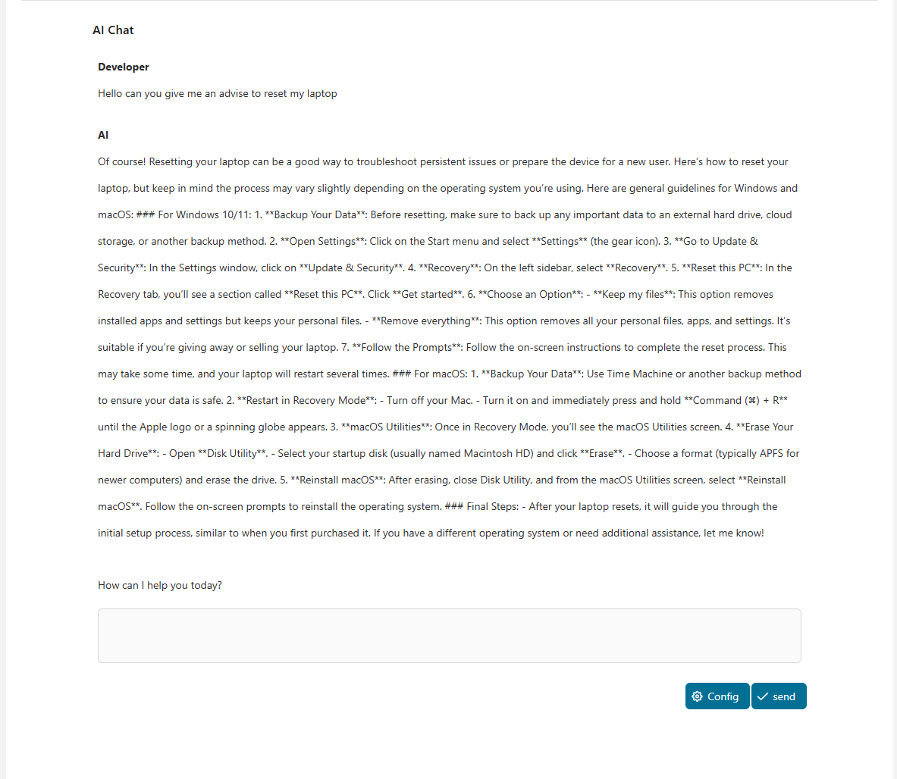
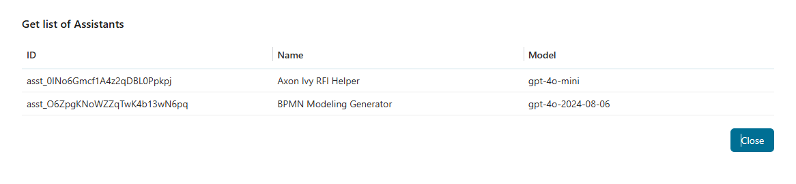

# OpenAI ChatGPT API

ChatGPT Ist ein AI Model entfaltet mal [OpenAI](https://openai.com/). Es kann
kommunizieren mit du in natural Sprache und unterstützen dir in verschiedener
Sprache-basisbezogene Tasks, wie antworten Fragen, schreibend Texte oder
#entwickelnd neue Ideen. Mit das OpenAI ChatGPT API Anschluss, du kannst
integrieren ChatGPT hinein euren #Axon Efeu dienstliche Anträge.

Dieser Anschluss:

- Ist gegründet weiter das OpenAI API shttps://Bahnsteig.openai.com/s
- Versieht einen simplen Schwatz frontend für nahtlos Integration hinein #Axon
  Efeu Anträge

## Demo

### ChatGPT Demo
Erfahr intelligente Unterhaltungen mit ChatGPT #bruchlos mit dieser Demo. Frag
irgendwelche Frage in irgendwelcher Sprache und auf Anhieb empfangen #präzise,
natural, und insightful Antworten—rechts innerhalb #Axon Efeu. Genieß ein
sauberes, intuitive Schnittstelle, Augenblick Feedback, und volle Flexibilität
für irgendwelche Situation.

Du können #voranbringen personalisieren eure AI Erfahrung auswählen mal
verschiedene Models und konfigurierend den Temperatur Parameter—#aufstellen von
0.0 zu 2.0—zu regulieren die Bilanz zwischen Genauigkeit und Kreativität.

- #Nieder Werte (#z.B., 0.0–0.3) → #Plangesteuert, präzis, und
  Tatsache-#gerichtet Antworten.

- Durchschnittliche Werte (#z.B., 0.4–0.7) → #Ausgewogen Antworten mit einer
  Mischung von Genauigkeit und Auswahl.

- #Hoch Werte (#z.B., 0.8–1.5) → More kreativ, divers, und informative
  Antworten, aber mit etwas #kleine #Vorhersehbarkeit.

- Sehr hohe Werte (>1.5) → Hoch kreativ, experimentelle Ausgaben, oft passend
  für Gedankenaustausch anstatt sachliche Genauigkeit.




Dies ist ein Arbeitsgang von ChatGPT Demo


## EmailGenerator Demo

Erfahr die Kraft von AI in automatisieren eure Anwerbung #Email verarbeitet
direkt innerhalb diese Demo. Einfach #betreten den KandidatenDetails, Beruf
Stelle, wesentliche Geschicklichkeiten, Interview Resultate, und Befrager
Auskunft — das System will automatisch generieren personalisierte #Email mit
professionell, natural, und Kontext-#angemessenen Inhalt (für entweder Akzeptanz
oder #Abweisung).

Fasten – #Präzise – Angemessen:

- Intuitive Schnittstelle: #Betreten alle Auskunft bedürft herein gerade einige
  Stufen.

- #Smart personalization: #Email Inhalt ist geschneidert basisbezogen auf #der
  #Daten versiehst du.

- Nahtlose Integration: Sende die #Email zu dem Kandidaten rechts #nachdem
  Erzeugung, ohne schalten Anträge.

Mit OpenAI Stellvertretende Unterstützung, jede Anwerbung #Email sendest willst
du speichern Zeit Weile #aufrechterhalten Professionalität und zeigend echte
Sorgfalt für den Kandidaten.


### GetAssistant Demo
Diese Demo erlaubt du zu schnell listen und identifizieren verfügbare
Assistenten, machend ihm leichter zu #ausgewählt das rechtes #man für
Unterhaltungen, #einverstanden Erzeugung, oder spezialisierte Tasks (wie RFI
Hilfe oder BPMN Kreation).

Zeigt eine Liste Assistenten geschafft herein eure OpenAI Konto. Jeder Assistent
ist ein konfigurierbares AI Agent mit sein eigenes:

- ID – Eine einmalige Bezeichnung für rufen oder #regelnd den Assistenten.

- Heiß – ein #beschreibend Etikett #hindeuten seine Aufgabe oder Rolle (#z.B.,
  #Axon Efeu RFI Helfer, BPMN #Modellieren Erzeuger).

- Modellier – das AI Model Version benutzt es (#z.B., gpt-4o-mini,
  gpt-4o-2024-08-06).



## Einrichtung

Plauder GPT Bitten kommen nicht #kostenlos. Indes, als meldest an du ein neues
Konto, 5$ ist automatisch zugefügt zu ihm. Dies ist perfekt zu entfalten euren
Schwatz GPT Integration gratis.

1. Melde an weiter ein Konto
   [Bahnsteig.openai.com](https://platform.openai.com/overview).
2. Einmal #loggen herein, Klick auf eure Nutzer Ikone auf dem #höhere #Rechter
   Ecke.
3. In der Speisekarte, benutz den "Ausblick API Schlüssel" Option.
4. Generier ein neues API #eintasten und lagern ihm in euren Variablen.yaml
   Unter `Variablen.openai-Anschluss.apiKey`

```
@variables.yaml@
```
